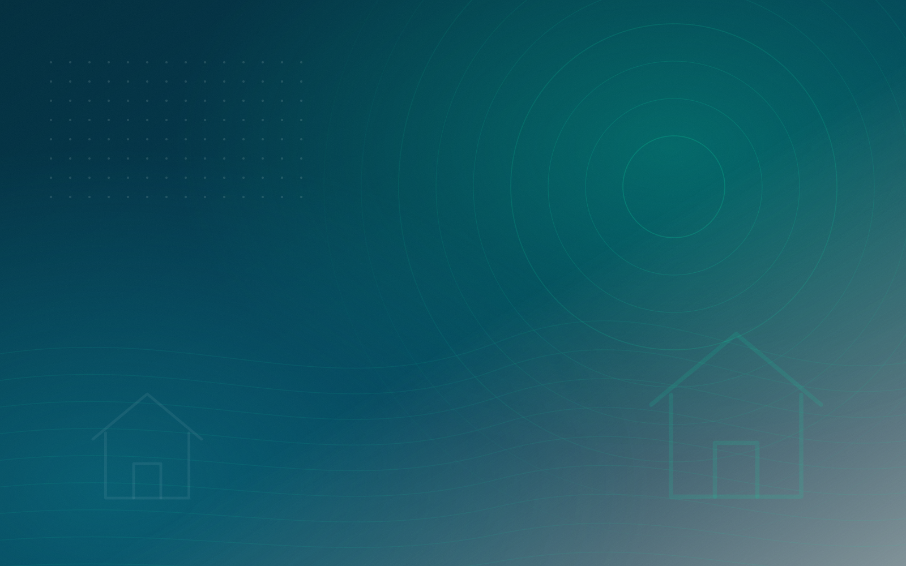

# Apex Pest Solutions

A production-ready marketing site for a residential + commercial pest control business.
Vanilla HTML, CSS and JavaScript — no build step, no framework, no runtime dependencies.

Three things make it more than a brochure:

- **A 24/7 AI receptionist** that identifies the pest, qualifies the ZIP code and hands the
  visitor straight into the booking flow — with browser speech-to-text and text-to-speech.
- **A six-step booking wizard** with a real calendar, availability windows, inline validation,
  loading/error/success states and a booking reference.
- **A clean integration layer** so the assistant, the booking flow and lead capture can each be
  pointed at a real backend by editing one config object.

---

## Run it

Any static host works. Locally, serve over HTTP rather than opening the file directly —
self-hosted fonts need a real origin:

```bash
python3 -m http.server 8000
# → http://localhost:8000
```

Deploy by uploading the repository root to Netlify, Vercel, Cloudflare Pages, S3, or any
web server. There is nothing to compile.

---

## Structure

```
index.html            Semantic markup, SEO metadata, JSON-LD, inline SVG icon sprite
styles.css            Design tokens + all component styles (one file, sectioned)
script.js             All behaviour, with CONFIG and three API adapters at the top
assets/fonts/         Self-hosted variable webfonts (~74 KB for latin-only visitors)
assets/img/           Brand artwork (SVG, ~64 KB total)
```

---

## Configuration

Everything you normally need to change lives in the `CONFIG` object at the top of `script.js`.

### Business details

```js
business: {
  name: 'Apex Pest Solutions',
  phone: '+17135550142',
  phoneDisplay: '(713) 555-0142',
  email: 'hello@apexpestsolutions.com',
  serviceZipPrefixes: ['770', '771', '772', ...],  // drives the AI service-area check
}
```

Phone numbers, the address and opening hours also appear in `index.html` (header, footer,
`tel:` links and the `LocalBusiness` JSON-LD) — update them there too.

### AI assistant

Ships in `mock` mode: a rule-based receptionist that handles pest identification, ZIP
validation, pricing, safety, hours, urgency, human handoff and booking — entirely offline.

To connect a real model, point it at **your own** endpoint:

```js
ai: {
  provider: 'api',
  endpoint: '/api/assistant',
  systemPrompt: '…',
}
```

Your endpoint receives:

```json
{ "messages": [{ "role": "system|user|assistant", "content": "…" }],
  "context": { "pest": "cockroach", "zip": "77002", "stage": "awaiting_zip" } }
```

and must return:

```json
{ "reply": "…", "quickReplies": [{ "label": "Book inspection", "value": "yes", "action": "book" }],
  "action": "book", "service": "cockroach" }
```

`action: "book"` opens the booking wizard with the service pre-selected; `action: "call"` on a
quick reply dials the business number. Replies are sanitised client-side — only `<strong>`,
`<em>`, `<b>`, `<i>` and `<br>` survive.

> Never put a provider API key in `script.js`. Proxy the call through a server route so the key
> stays server-side.

### Booking

```js
booking: {
  provider: 'webhook',
  endpoint: '/api/bookings',
  leadTimeDays: 1,       // earliest bookable day
  horizonDays: 75,       // furthest bookable day
  closedWeekdays: [0],   // 0 = Sunday
  slots: [ /* arrival windows */ ],
}
```

The endpoint receives one JSON payload (reference, service, property, appointment with IANA
timezone, and customer details). Fan out from there to Google Calendar, Calendly, your CRM,
and email/SMS confirmations — keeping those integrations server-side means no credentials
reach the browser.

Availability is currently derived deterministically from the date so the demo behaves
consistently. Replace `renderSlots()` in `script.js` with a call to your real availability API.

### Lead capture

The footer subscribe form uses the same pattern — set `lead.provider` to `'webhook'` and give
it an `endpoint` (Web3Forms, Formspree, Make, Zapier or your own route).

---

## Photography

The site ships with bundled SVG brand artwork so it renders correctly with zero external
requests. Every `` also declares the photo that should replace it:

```html

```

To use your own licensed photography:

1. Save each photo at its `data-photo` path (same basename, `.jpg`).
2. Set `photoSwap: true` in `CONFIG`.

The photos are then picked up automatically — no markup changes. The flag is off by default so
the browser never logs 404s for files that aren't there yet. Recommended shots:

| File | Subject |
| --- | --- |
| `hero-technician.jpg` | Technician treating a property (wide, 1600×1000) |
| `trust-inspection.jpg` | Technician inspecting indoors (portrait, 1100×1300) |
| `process-team.jpg` | Team preparing equipment (portrait, 1100×1200) |
| `home-treatment.jpg` | Interior inspection of a family home (1300×1100) |
| `cta-home.jpg` | Protected home exterior (wide, 1800×900) |
| `blog-*.jpg` | Article headers (800×560) |

---

## Before you launch

- [ ] **Replace the statistics.** The counters in the Statistics section are placeholders.
      Update the `data-count-to` attributes in `index.html` with figures you can substantiate,
      or remove the section. Do not publish unverified claims.
- [ ] Replace the placeholder licence number (`TDA licence #PCL-00000`) in the trust badge.
- [ ] Replace the `555` phone number, address and email throughout.
- [ ] Update the canonical URL, Open Graph URLs and JSON-LD `url` from
      `https://www.apexpestsolutions.com/` to your real domain.
- [ ] Export `assets/img/og-cover.svg` to a 1200×630 JPG or PNG and point the `og:image` and
      `twitter:image` tags at it — some social platforms do not render SVG previews.
- [ ] Point the blog cards and the Privacy / Terms / Accessibility links at real pages.
- [ ] Swap the testimonials for real, attributable reviews.
- [ ] Confirm the review badges match where the reviews actually came from.

---

## Notes

- **Accessibility** — skip link, visible focus rings, a focus-trapped mobile drawer, labelled
  form controls with inline errors, `aria-live` on the chat log, and WCAG AA text contrast
  throughout. `prefers-reduced-motion` disables animation, and every section renders fully with
  JavaScript disabled.
- **Performance** — no third-party requests at all. Self-hosted variable fonts with
  `unicode-range` subsetting, lazy-loaded images with explicit dimensions (no layout shift),
  and a hero preload.
- **SEO** — semantic landmarks, a single sequential heading outline, canonical URL, Open Graph
  and Twitter cards, plus `LocalBusiness`/`PestControlService`, `WebSite`, `Service` and
  `FAQPage` JSON-LD.
- **Browser support** — evergreen Chrome, Edge, Firefox and Safari. Speech recognition is
  Chromium-only; the microphone button hides itself where it isn't supported.
- **Extending it** — `window.Apex` exposes `{ config, booking, assistant }` for analytics or
  further integration, and an `apex:booked` event fires on `document` with the full payload
  whenever a booking succeeds.
